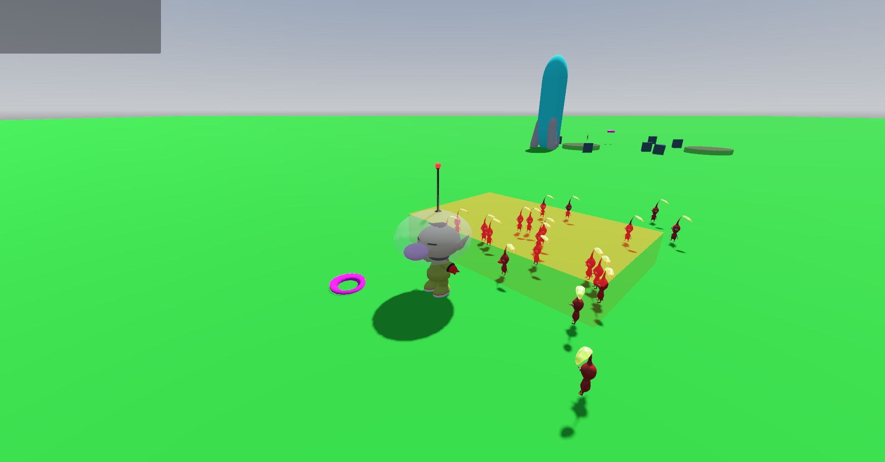
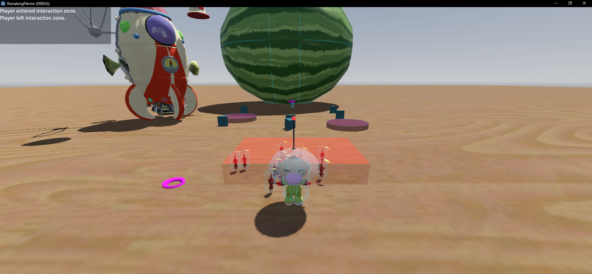

# Pikmin-Like Godot Project

A small Godot 4.x project that demonstrates basic Pikmin-style mechanics.

The player character can: spawn and dismiss Pikmin, interact with objects, throw pikmin, and the Pikmin have states (following, idle, gathering, etc).





## Devlog

Follow the devlopment of this project on my youtube channel!

https://www.youtube.com/playlist?list=PLDro2ocyyqr3wBovocBWXJVdRRxccXh1r

## Features

* Third-Person Camera
* Smooth 3D movement and camera controls.
* Multiple camera angles and zoom levels (over-the-shoulder and bird’s-eye view).
* Pikmin AI States

```
# FOLLOWING: Pikmin moves alongside the player.
# WAITING: Pikmin stands in place (placeholder for future expansions).
# IDLE: Pikmin does nothing.
# GATHERING: Placeholder for resource/object gathering mechanics.
# THROW: Pikmin is thrown in an arc by the player.
```

### Pikmin Summoning / Dismissal

* Summon new Pikmin with a key press (currently bound to spawn_pikmin == P key).

* Dismiss all following Pikmin back to an idle state (currently bound to dismiss_squad == X or Y key).

### Interaction Zones Area3D

* Detects when the player enters/exits a zone.
* Toggles an interaction prompt (3D mesh or UI element) when inside the zone.
* Handles interactions (i.e., opening a door, starting dialogue, etc.).

## Relevant Code:
	
Player.gd
Inherits CharacterBody3D. Responsible for player movement, camera logic, spawning Pikmin, dismissing Pikmin, and handling interactions.

Pikmin.gd
Inherits CharacterBody3D. Implements a simple state machine for Pikmin behavior, including navigation using NavigationAgent3D.

InteractionZone.gd
Inherits Node3D. Uses an Area3D to detect when the player enters/exits the zone and triggers an interaction prompt.

PikminContainer and IdlePikminContainer
These are just organizational nodes in the scene that group active and idle Pikmin for easier management and separation.

### Requirements
Godot 4.x
This project uses Godot 4’s new GDScript syntax and features (such as @onready and @export). Make sure you’re running Godot 4 or later.

### Installation & Usage
Clone or Download this repository.
Open the project with Godot 4.
Run the main scene

### Controls Keyboard:
* W/A/S/D: Move forward, left, backward, right.
* Left Click: Captures the mouse for camera control.
* Esc:  Release mouse capture / show mouse cursor.
* E: interact
* P: for Spawn Pikmin
* Q: Toggle Interaction Menu on/off

### Controls Controller (Xbox For Reference):
* Left Stick: Player Movement
* Left Trigger: Recenter Camera To Players Back
* Right Bumper: Toggle Birds-Eye View
* Right Trigger: Zoom in/out
* A: Interact
* X/Y: Dismiss Pikmin

### Contributing
* Pull Requests are welcome! For major changes, please open an issue first to discuss what you would like to change.
* Feedback / Bug Reports: Feel free to create issues for anything you encounter.

### Possible Future Additions
* Proper 3D Camera Controls instead of recentering the camera to the player.
* Level Editor
* Bosses
* Levels
* Campaigns
* Animations
